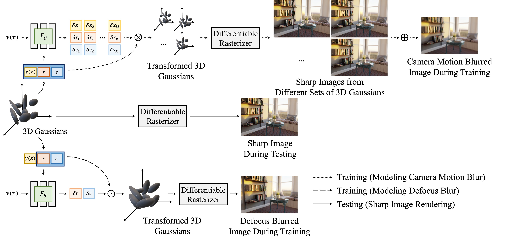

# Deblurring-3D-Gaussian-Splatting

Byeonghyeon Lee*, Howoong Lee*, Xiangyu Sun, Usman Ali, and Eunbyung Park

[Project Page](https://benhenryl.github.io/Deblurring-3D-Gaussian-Splatting/) &nbsp; [Paper](https://arxiv.org/abs/2401.00834) 

Our code is based on [3D Gaussian Splatting](https://github.com/graphdeco-inria/gaussian-splatting)

**05.28**: Our paper is updated with new features (ex. camera motion blur deblurring, more experiments, ...) so please check the new paper at https://arxiv.org/abs/2401.00834. 


## Method Overview


Our method's overall workflow. Dotted arrows and dashed arrows describe the pipeline for modeling camera motion blur and modeling defocus blur, respectively at training time. Solid arrows show the process of rendering sharp images at the inference time. Please refer to the paper for more details.

## Setup
###  1. Installation
```
git clone https://github.com/benhenryL/Deblurring-3D-Gaussian-Splatting.git --recursive 
conda env create --file environment.yml
conda activate deblurring_3dgs
```
### 2. Dataset
Please download datasets at [here](https://drive.google.com/file/d/1N24ipi52XXiPfqWWAxYeyaItNXrL7nSe/view?usp=drive_link). deblur_dataset.zip file includes 4 datasets: real camera motion blur, real defocus blur, synthetic camera motion blur, and synthetic defocus blur.
This dataset is originally produced by [Deblur-NeRF](https://github.com/limacv/Deblur-NeRF), but we reran COLMAP to create point clouds and images are identical to the original ones. Even if you already have the dataset, please download this one.

### 3. Training
```
python train.py -s <dataset> --expname <name for output files> --config configs/<config file for different dataset>

// ex. python train.py --expname test_ball -s data/real_camera_motion_blur/blurball --config configs/real_camera_motion.txt
```

### 4. Evaluation
At every testing iteration, the evaluation result is saved at psnr.txt. Or you can evaluate the trained model with
```
python render.py -m <model path> -s <dataset>

//ex. python render.py -m output/test_ball -s data/real_camera_motion_blur/blurball
```
You can also download the pretrained models at [here](https://drive.google.com/file/d/1ECFCM2OvRYMHO_EkGmD_qKS8fUKTmSY7/view?usp=drive_link)

## BibTeX
```
@misc{lee2024deblurring,
      title={Deblurring 3D Gaussian Splatting}, 
      author={Byeonghyeon Lee and Howoong Lee and Xiangyu Sun and Usman Ali and Eunbyung Park},
      year={2024},
      eprint={2401.00834},
      archivePrefix={arXiv},
      primaryClass={cs.CV}
}
```


